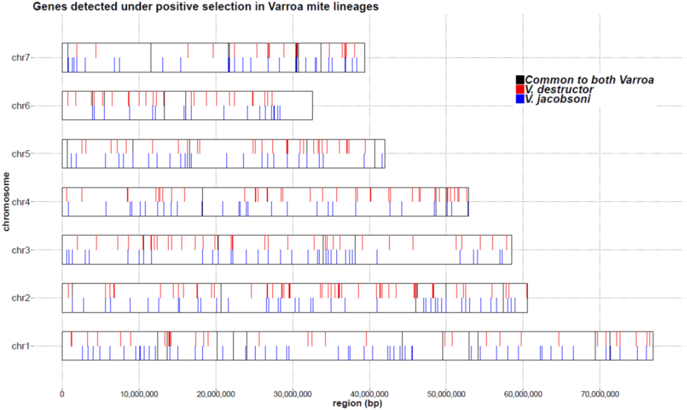
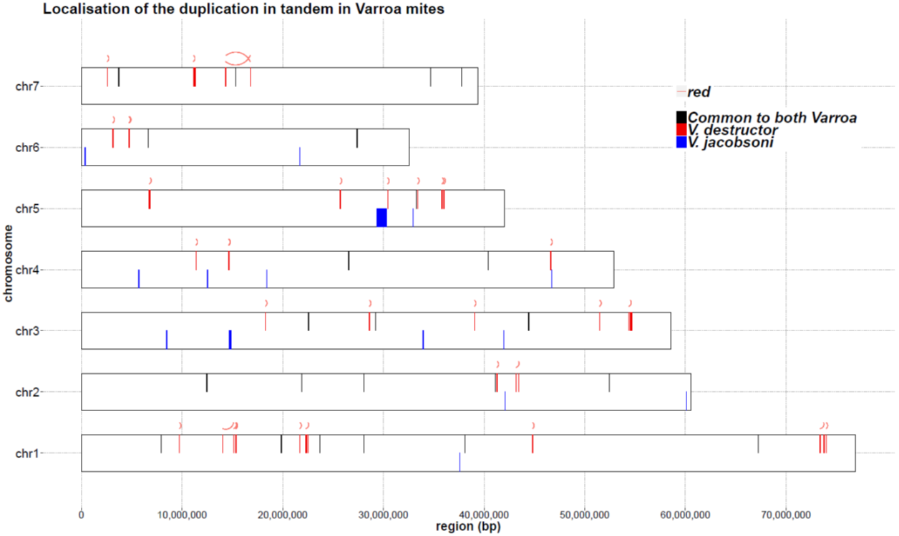

```{r setup, include=FALSE}
knitr::opts_chunk$set(echo = TRUE)
```

This document was written in R Markdown, and translated into .html using the R package `knitr`. Press the buttons labelled **Code** to show the R code.

```{r message=FALSE, warning=FALSE, results="hide"}
library("tidyverse")
library("knitr") # for the markdown
library("kableExtra") # for creating a scrolling table
library("ggplot2") # for plotting 
library("ape") # for reading the phylogenetic tree
library("Biostrings")
library("ggtree") # for plotting the tree
library("ggrepel") # for spreading text labels on the plot
library("scales") # for axis labels notation
library("tidyverse")
library("GO.db")
library("WGCNA")
library("reshape2")
library("RSQLite")
library("AnnotationDbi")
library("GSEABase")
library("GOstats")
library("maps") # for the map background
library("leaflet") #for the interactive maps
library("htmltools")
library("rgdal")
library("grid")
library("gridExtra")

```

**Background:** Varroa mites are specialist ectoparasites of _Apis_ honey bees, originally distributed throughout Asia. Within the cryptic genus, two sister species <span style="color:red"> _Varroa destructor_ </span> and <span style="color:blue">  _Varroa jacobsoni_ </span> have drawn attention as they both independently and repeatdely switched host from the Eastern honey bee _Apis cerana_ to the Western honey bee _A. mellifera_. 

These two mites are morphologically similar, occupy the same ecological niche as brood parasite and present identical parasite life cycle which is synchronized to their common hosts. Yet it is unclear whether _Varroa destructor_ and _Varroa jacobsoni_ evolved toward similar or divergent adaptations to their hosts. 

We expected that the co-evolutive arm-race between the mite-parasite and its bee-host will leave genomic footprints through positively selected genes (dN/dS) in Varroa genomes. Although, _Varroa destructor_ and _Varroa jacobsoni_ both jumped onto _A. mellifera_, ~80 years ago and 11 years ago respectively; we hypothesized that most of positive selection signatures should result from co-evolution with their original host _A. cerana_.


# 1| Reported distribution of Varroa mites on the Eastern honey bee

Only a taxonomical expert eye or meticulous morphometrical measurements allow to differentiate <span style="color:red"> _Varroa destructor_ </span> and <span style="color:blue">  _Varroa jacobsoni_ </span> on the field. It is also possible to assume one species presence regarding their geographical distribution given these species were originally parapatric on the Eastern honey bee. 

We reviewed the reported presence of each of this mite on their original host by collecting data from both litterature and NCBI confirming its presence by mtDNA barcoding.

``` {r load worldlayer, warning=FALSE, results="hide", cache = TRUE}
# Download the country borders layer
#download.file("http://thematicmapping.org/downloads/TM_WORLD_BORDERS_SIMPL-0.3.zip" , destfile="world_shape_file.zip")
#system("unzip world_shape_file.zip")
world_spdf=readOGR(dsn= getwd() , layer="TM_WORLD_BORDERS_SIMPL-0.3")

```

The following interactive map focuse in Asia where Varroa mites occur naturally on _A. cerana_ : it is possible to zoom in and out, and passing the cursor on one point give basic information on the year and reporter. 

On the top right corner of the map, a control button allow to add/remove layers containing mtDNA haplogroup information for each Varroa species.  

Color dots represent species distribution as:  
<span style="color:red"> _Varroa destructor_ </span>  
<span style="color:blue"> _Varroa jacobsoni_ </span>  
<span style="color:green"> _Varroa underwoodi_ </span>  
<span style="color:black"> _Varroa sp._ </span>  

``` {r leaflet map, warning=FALSE, cache = TRUE}
#Data with exact or approximate GPS coordinates obtained from references
coordvarroa <- read.csv("data/Map/mappingpoints_Varroacerana2019.csv", header = TRUE)

coord.vdac <- coordvarroa %>% filter(Species == "Vdestructor") %>% filter(Host == "Acerana") 
coord.vjac <- coordvarroa %>% filter(Species == "Vjacobsoni") %>% filter(Host == "Acerana")

### Subset the data for only Varroa sp. on the Eastern honey bee
coord.vspac <- coordvarroa %>% filter(Species == "Vsp.") %>% filter(Host == "Acerana")
coord.vunac <- coordvarroa %>% filter(Species == "Vunderwoodi") %>% filter(Host == "Acerana")

## Distribution of Varroa destructor mtDNA lineages on Apis cerana

vdac.K <- coord.vdac[coord.vdac$Haplogroup =="Korea",]
vdac.J <- coord.vdac[coord.vdac$Haplogroup =="Japan",]
vdac.KJ <- coord.vdac[coord.vdac$Haplogroup =="Korea & Japan",]
vdac.V <- coord.vdac[coord.vdac$Haplogroup =="Vietnam",]
vdac.KV <- coord.vdac[coord.vdac$Haplogroup =="Korea & Vietnam",]
vdac.C1 <- coord.vdac[coord.vdac$Haplogroup =="China C1",]
vdac.C2 <- coord.vdac[coord.vdac$Haplogroup =="China C2",]
vdac.C2C3 <- coord.vdac[coord.vdac$Haplogroup =="China C2 & C3",]
vdac.N <- coord.vdac[coord.vdac$Haplogroup =="Nepal",]

vjac.Mal <- coord.vjac[coord.vjac$Haplogroup =="Malaysia",]
vjac.Jav <- coord.vjac[coord.vjac$Haplogroup =="Java",]
vjac.Amb <- coord.vjac[coord.vjac$Haplogroup =="Ambon",]
vjac.Lom <- coord.vjac[coord.vjac$Haplogroup =="Lombok",]
vjac.Bal <- coord.vjac[coord.vjac$Haplogroup =="Bali",]
vjac.Sbw <- coord.vjac[coord.vjac$Haplogroup =="Sumbawa",]
vjac.Sum <- coord.vjac[coord.vjac$Haplogroup =="Sumatra",]
vjac.Flo <- coord.vjac[coord.vjac$Haplogroup =="Flores",]
vjac.Sam <- coord.vjac[coord.vjac$Haplogroup =="Samui",]
vjac.Bor <- coord.vjac[coord.vjac$Haplogroup =="Borneo",]
vjac.NT <- coord.vjac[coord.vjac$Haplogroup =="NorthThai",]
vjac.NTM <- coord.vjac[coord.vjac$Haplogroup =="Malaysia & NorthThai",]

# Prepare the map title
tag.map.title2 <- tags$style(HTML("
  .leaflet-control.map-title2 { 
    transform: translate(-50%,20%);
    text-align: center;
    padding-left: 10px; 
    padding-right: 10px; 
    background: rgba(255,255,255,0.75);
    font-weight: bold;
    font-size: 20px;
  }
"))

title <- tags$div(
  tag.map.title2, HTML("Varroa mites on Apis cerana")
)  

leaflet(coord.vdac) %>% 
  addTiles(group = "OSM (default)") %>%
  ## add the layer other than default we would like to use for background
  addProviderTiles(providers$CartoDB.PositronNoLabels, group = "Positron NoLabels") %>%
  
  
  ## VARROA DESTRUCTOR LAYERS
  addCircleMarkers(data = coord.vdac, coord.vdac$coord.Y, coord.vdac$coord.X,
                   weight = 0.5,
                   col = "red", 
                   radius = 4, 
                   fillOpacity = 0.9, 
                   stroke = T, 
                   label = ~as.character(Description), 
                   group = 'V. destructor') %>%
  
  
  ## adding each lineage group as a layer for V. destructor on cerana
  addCircleMarkers(data = vdac.K, vdac.K$coord.Y, vdac.K$coord.X,
                   weight = 0.5,
                   col = "#FB0000", 
                   radius = 4, 
                   fillOpacity = 0.9, 
                   stroke = T, 
                   label = ~as.character(Description), 
                   group = 'V. destructor K1 lineage') %>%
  addCircleMarkers(data = vdac.J, vdac.J$coord.Y, vdac.J$coord.X,
                   weight = 0.5,
                   col = "#9707E7", 
                   radius = 4, 
                   fillOpacity = 0.9, 
                   stroke = T, 
                   label = ~as.character(Description), 
                   group = 'V. destructor J1 lineage') %>%
  addCircleMarkers(data = vdac.KJ, vdac.KJ$coord.Y, vdac.KJ$coord.X,
                   weight = 0.5,
                   col = "#9005DC", 
                   radius = 4, 
                   fillOpacity = 0.9, 
                   stroke = T, 
                   label = ~as.character(Description), 
                   group = 'K1 & J1 co-infection') %>%
  addCircleMarkers(data = vdac.V, vdac.V$coord.Y, vdac.V$coord.X,
                   weight = 0.5,
                   col = "#FFAA00", 
                   radius = 4, 
                   fillOpacity = 0.9, 
                   stroke = T, 
                   label = ~as.character(Description), 
                   group = 'V. destructor V1 lineage') %>%
  addCircleMarkers(data = vdac.C1, vdac.C1$coord.Y, vdac.C1$coord.X,
                   weight = 0.5,
                   col = "#920053", 
                   radius = 4, 
                   fillOpacity = 0.9, 
                   stroke = T, 
                   label = ~as.character(Description), 
                   group = 'V. destructor C1 lineage') %>%
  addCircleMarkers(data = vdac.C2, vdac.C2$coord.Y, vdac.C2$coord.X,
                   weight = 0.5,
                   col = "#B53A80", 
                   radius = 4, 
                   fillOpacity = 0.9, 
                   stroke = T, 
                   label = ~as.character(Description), 
                   group = 'V. destructor C2 lineage') %>%
  addCircleMarkers(data = vdac.C2C3, vdac.C2C3$coord.Y, vdac.C2C3$coord.X,
                   weight = 0.5,
                   col = "#CE97B6", 
                   radius = 4, 
                   fillOpacity = 0.9, 
                   stroke = T, 
                   label = ~as.character(Description), 
                   group = 'C2 & C3 co-infection') %>%
  addCircleMarkers(data = vdac.N, vdac.N$coord.Y, vdac.N$coord.X,
                   weight = 0.5,
                   col = "#4A4A4A", 
                   radius = 4, 
                   fillOpacity = 0.9, 
                   stroke = T, 
                   label = ~as.character(Description), 
                   group = 'V. destructor? Nepal lineage') %>%
  addCircleMarkers(data = vdac.KV, vdac.KV$coord.Y, vdac.KV$coord.X,
                   weight = 0.5,
                   col = "#FFDD00", 
                   radius = 4, 
                   fillOpacity = 0.9, 
                   stroke = T, 
                   label = ~as.character(Description), 
                   group = 'K1 & V1 co-infection') %>%
  
  ## VARROA JACOBSONI
  addCircleMarkers(data = coord.vjac, coord.vjac$coord.Y, coord.vjac$coord.X,
                   weight = 0.5,
                   col = "blue", 
                   radius = 4, 
                   fillOpacity = 0.9, 
                   stroke = T, 
                   label = ~as.character(Description), 
                   group = 'V. jacobsoni') %>%
  
  ## adding each lineage group as a layer for V. jacobsoni on cerana
  addCircleMarkers(data = vjac.NT, vjac.NT$coord.Y, vjac.NT$coord.X,
                   weight = 0.5,
                   col = "#5A0DC1", 
                   radius = 4, 
                   fillOpacity = 0.9, 
                   stroke = T, 
                   label = ~as.character(Description), 
                   group = 'V. jacobsoni NorthThai') %>%
  addCircleMarkers(data = vjac.Mal, vjac.Mal$coord.Y, vjac.Mal$coord.X,
                   weight = 0.5,
                   col = "#0F4ABF", 
                   radius = 4, 
                   fillOpacity = 0.9, 
                   stroke = T, 
                   label = ~as.character(Description), 
                   group = 'V. jacobsoni Malaysia') %>%
  addCircleMarkers(data = vjac.Sam, vjac.Sam$coord.Y, vjac.Sam$coord.X,
                   weight = 0.5,
                   col = "#5A7BBC", 
                   radius = 4, 
                   fillOpacity = 0.9, 
                   stroke = T, 
                   label = ~as.character(Description), 
                   group = 'V. jacobsoni Samui') %>%
  addCircleMarkers(data = vjac.NTM, vjac.NTM$coord.Y, vjac.NTM$coord.X,
                   weight = 0.5,
                   col = "#137575", 
                   radius = 4, 
                   fillOpacity = 0.9, 
                   stroke = T, 
                   label = ~as.character(Description), 
                   group = 'V. jacobsoni Malaysia & NorthThai') %>%
  addCircleMarkers(data = vjac.Bor, vjac.Bor$coord.Y, vjac.Bor$coord.X,
                   weight = 0.5,
                   col = "#6AB28D", 
                   radius = 4, 
                   fillOpacity = 0.9, 
                   stroke = T, 
                   label = ~as.character(Description), 
                   group = 'V. jacobsoni Borneo') %>%
  addCircleMarkers(data = vjac.Jav, vjac.Jav$coord.Y, vjac.Jav$coord.X,
                   weight = 0.5,
                   col = "#0F933C", 
                   radius = 4, 
                   fillOpacity = 0.9, 
                   stroke = T, 
                   label = ~as.character(Description), 
                   group = 'V. jacobsoni Java') %>%
  addCircleMarkers(data = vjac.Sum, vjac.Sum$coord.Y, vjac.Sum$coord.X,
                   weight = 0.5,
                   col = "#A4CE01", 
                   radius = 4, 
                   fillOpacity = 0.9, 
                   stroke = T, 
                   label = ~as.character(Description), 
                   group = 'V. jacobsoni Sumatra') %>%
  addCircleMarkers(data = vjac.Bal, vjac.Bal$coord.Y, vjac.Bal$coord.X,
                   weight = 0.5,
                   col = "#D6D601", 
                   radius = 4, 
                   fillOpacity = 0.9, 
                   stroke = T, 
                   label = ~as.character(Description), 
                   group = 'V. jacobsoni Bali') %>%
  addCircleMarkers(data = vjac.Lom, vjac.Lom$coord.Y, vjac.Lom$coord.X,
                   weight = 0.5,
                   col = "#FFFC56", 
                   radius = 4, 
                   fillOpacity = 0.9, 
                   stroke = T, 
                   label = ~as.character(Description), 
                   group = 'V. jacobsoni Lombok') %>%
  addCircleMarkers(data = vjac.Sbw, vjac.Sbw$coord.Y, vjac.Sbw$coord.X,
                   weight = 0.5,
                   col = "#FFDD00", 
                   radius = 4, 
                   fillOpacity = 0.9, 
                   stroke = T, 
                   label = ~as.character(Description), 
                   group = 'V. jacobsoni Sumbawa') %>%
  addCircleMarkers(data = vjac.Flo, vjac.Flo$coord.Y, vjac.Flo$coord.X,
                   weight = 0.5,
                   col = "#FFE9A7", 
                   radius = 4, 
                   fillOpacity = 0.9, 
                   stroke = T, 
                   label = ~as.character(Description), 
                   group = 'V. jacobsoni Flores') %>%
  addCircleMarkers(data = vjac.Amb, vjac.Amb$coord.Y, vjac.Amb$coord.X,
                   weight = 0.5,
                   col = "#3A3831", 
                   radius = 4, 
                   fillOpacity = 0.9, 
                   stroke = T, 
                   label = ~as.character(Description), 
                   group = 'V. jacobsoni Ambon') %>%
  
  
  ## adding Varroa sp. layer
  addCircleMarkers(data = coord.vspac, coord.vspac$coord.Y, coord.vspac$coord.X,
                   weight = 0.5,
                   col = "black", 
                   radius = 4, 
                   fillOpacity = 0.9, 
                   stroke = T, 
                   label = ~as.character(Description), 
                   group = 'Varroa sp. Luzon lineage') %>%
  addCircleMarkers(data = coord.vunac, coord.vunac$coord.Y, coord.vunac$coord.X,
                   weight = 0.5,
                   col = "green", 
                   radius = 4, 
                   fillOpacity = 0.9, 
                   stroke = T, 
                   label = ~as.character(Description), 
                   group = 'Varroa underwoodi') %>%  
  
  addLayersControl(position = "topright",
    baseGroups = c("OSM (default)", "Positron NoLabels"),
    overlayGroups = c("V. destructor",  
                      "V. jacobsoni", 
                      "Varroa sp. Luzon lineage",
                      "Varroa underwoodi",
                      "V. destructor K1 lineage", 
                      "V. destructor J1 lineage", 
                      "K1 & J1 co-infection", 
                      "V. destructor V1 lineage", 
                      "K1 & V1 co-infection", 
                      "V. destructor C1 lineage", 
                      "V. destructor C2 lineage", 
                      "C2 & C3 co-infection", 
                      "V. destructor? Nepal lineage",
                      "V. jacobsoni NorthThai", 
                      "V. jacobsoni Malaysia", 
                      "V. jacobsoni Malaysia & NorthThai",
                      "V. jacobsoni Samui", "V. jacobsoni Sumatra",
                      "V. jacobsoni Borneo",
                      "V. jacobsoni Java",  
                      "V. jacobsoni Bali", 
                      "V. jacobsoni Lombok",  
                      "V. jacobsoni Sumbawa",  
                      "V. jacobsoni Flores", 
                      "V. jacobsoni Ambon"),
    options = layersControlOptions(collapsed = TRUE))  %>%
  ## adding a title for the map
  addControl(title, position = "bottomright", className="map-title2") %>% 
  ## show the positron background prerably to the OSM layer
  showGroup("Positron NoLabels") %>% 
  hideGroup("V. destructor K1 lineage") %>% 
  hideGroup("V. destructor J1 lineage") %>%   
  hideGroup("K1 & J1 co-infection") %>% 
  hideGroup("V. destructor V1 lineage") %>% 
  hideGroup("K1 & V1 co-infection") %>% 
  hideGroup("V. destructor C1 lineage") %>% 
  hideGroup("V. destructor C2 lineage") %>% 
  hideGroup("C2 & C3 co-infection") %>% 
  hideGroup("V. destructor? Nepal lineage") %>% 
  hideGroup("V. jacobsoni NorthThai") %>% 
  hideGroup("V. jacobsoni Malaysia") %>% 
  hideGroup("V. jacobsoni Malaysia & NorthThai") %>% 
  hideGroup("V. jacobsoni Samui") %>% 
  hideGroup("V. jacobsoni Sumatra") %>% 
  hideGroup("V. jacobsoni Borneo") %>% 
  hideGroup("V. jacobsoni Java") %>% 
  hideGroup("V. jacobsoni Bali") %>% 
  hideGroup("V. jacobsoni Lombok") %>% 
  hideGroup("V. jacobsoni Sumbawa") %>% 
  hideGroup("V. jacobsoni Flores") %>% 
  hideGroup("V. jacobsoni Ambon")

```

# 2| Annotated orthogroups for Varroa mites and Acari

## Details of the orthogroups defined by ORTHONOME

<span style="color:red"> _Varroa destructor_ </span> [(GCA_002443255.1)](https://www.ncbi.nlm.nih.gov/assembly/GCF_002443255.1/) and <span style="color:blue">  _Varroa jacobsoni_ </span> [(GCA_002532875.1)](https://www.ncbi.nlm.nih.gov/assembly/GCF_002532875.1/) genomes were compared with those of four other Acari species:  
  
- the non-Varroid honey bee ectoparasite _Tropilaelaps mercedesae_ [(GCA_002081605.1)](https://www.ncbi.nlm.nih.gov/assembly/GCA_002081605.1/);  
**Dong et al,. GigaScience (2017), 6(3), 1-17**  

- the ectoparasitic tick _Ixodes scapularis_ [(GCA_000208615.1)](https://www.ncbi.nlm.nih.gov/assembly/GCF_000208615.1/);  
  
- the free-living mite _Metaseiulus occidentalis_ [(GCA_000255335.1)](https://www.ncbi.nlm.nih.gov/assembly/GCF_000255335.1/);  
**Hoy et al., Genome Biology and Evolution (2016), 8(6), 1762-1775**  
  
- the free-living mite _Tetranychus urticae_ [(GCA_000239435.1)](https://www.ncbi.nlm.nih.gov/assembly/GCF_000239435.1/)  
**Grbicet al,. Nature (2011), 479(7374), 487-492**  


``` {r orthogroup plot, cache = TRUE}
tableS1 <- read.csv("data/Orthogroups/tableS01-orthogroups.csv")

g <- ggplot(tableS1, aes(x=shared))
g <-  g + geom_bar(color="black", fill="gray")
g <-  g + labs(title="Shared orthogroups by the six species",x="Number of species", y = "Orthrogroups")
g <-  g + geom_text(stat='count', aes(label=..count..), vjust=-1)
g <-  g + theme_classic()
g <-  g + ylim(0,5500)
g
```

Below is the summary output of orthologs genes (with NCBI gene ID) among the six Acari species as obtained using the [ORTHONOME](www.orthonome.com) pipeline.  
SOG = super orthologue group and OG = orthologue group.

``` {r orthogroup table, cache = TRUE}
kable(cbind(tableS1)) %>%
  kable_styling(bootstrap_options = "striped", font_size = 10) %>%
  scroll_box(width = "100%", height = "400px")

```
  

## Gene ontology terms associated with orthologs clusters

Regarding the Acari phylogenetic tree (Figure 3), ortholog genes specific to each lineage were enriched using the [goatools pipeline](https://github.com/tanghaibao/goatools).

``` {r phylotree, cache = TRUE}
acariphylo <- read.tree("data/Orthogroups/tree_rooted.nwk")

ggtree(acariphylo) + 
  geom_tiplab() +
  geom_nodepoint()+
  geom_hilight(node=11, fill="purple", alpha = 0.1) +
  geom_cladelabel(node=11, label="Varroidae", color="purple2", offset=.20, align=TRUE)+ 
  geom_hilight(node=10, fill="purple", alpha = 0.1) +
  geom_hilight(node=9, fill="purple", alpha = 0.1) +
  geom_hilight(node=8, fill="purple", alpha = 0.1) +
  theme_tree2() + 
  xlim(0,1.1)+
  theme_tree()

```

Below, are the details for these orthology clusters shared by Varroa mites and _T. mercedesae_ (ASIAN-MITES); + _M. occidentalis_ (MESOSTIGMATA); + _I. scapularis_ (PARASITIFORMES); and + _T. urticae_ (ROOT).

Ontology BP = Biological Processes, CC = Cellular Components and MF = Molecular Function.

``` {r orthogroup GOterms, cache = TRUE}

tableS2 <- read.csv("data/Orthogroups/tableS02-goshared.csv")

kable(cbind(tableS2)) %>%
  kable_styling(bootstrap_options = "striped", font_size = 10) %>%
  scroll_box(width = "100%", height = "400px")

```

# 3| Genes detected under positive selection

## Chromosomal localisation and Varroa karyogram

Here we created a karyogram of the seven major chromosome assembled in the <span style="color:red">  _Varroa destructor_ </span> reference genome and plot the location of the genes detected under positive selection. The localization and description of each gene were summarized in separate species files after searching for their ID in NCBI database and in the .gff annotation file.  

The following code generate a .pdf file with the full karyogram but due to the need for high resolution to properly see the bands, only a snapshot in .tiff file is presented as preview.  

The karyogram plot was inspired from the script detailed [here](https://www.biostars.org/p/269857/).

``` {r karyogram positive sel, message=FALSE, warning=FALSE, results="hide", cache = TRUE}
# chr1 is BEIS01000001.1 or NW_019211454.1
# chr2 is BEIS01000002.1 or NW_019211455.1
# chr3 is BEIS01000003.1 or NW_019211456.1
# chr4 is BEIS01000004.1 or NW_019211457.1
# chr5 is BEIS01000005.1 or NW_019211458.1
# chr6 is BEIS01000006.1 or NW_019211459.1
# chr7 is BEIS01000007.1 or NW_019211460.1

# Varroa destructor chromosome sizes
chrom_sizes <- structure(list(V1 = c("chr1", "chr2", "chr3", "chr4", 
"chr5", "chr6", "chr7"), V2 = c(76898487L, 60562263L, 58536683L, 52889743L, 41990949L, 32556156L, 39399627L)), .Names = c("V1", 
"V2"), class = "data.frame", row.names = c(NA, -7L))
colnames(chrom_sizes) <- c("chromosome", "size")

## Read files with information on chromosome location (for illustration purpose genes span was 5000bp from the starting point to be visible on the karyogram)
regionsvd <- read.csv("data/Positive selection/Vd-location-17072018-short.csv")

regionsvj <- read.csv("data/Positive selection/Vj-location-17072018-short.csv")

common <- read.csv("data/Positive selection/Varroa-ancestor-20072018-short.csv")

chrom_order <- c("chr1", "chr2", "chr3", "chr4", "chr5", "chr6", "chr7")
chrom_key <- setNames(object = as.character(c(1, 2, 3, 4, 5, 6, 7)), nm = chrom_order)
chrom_order <- factor(x = chrom_order, levels = rev(chrom_order))

# convert the chromosome column in each dataset to the ordered factor
chrom_sizes[["chromosome"]] <- factor(x = chrom_sizes[["chromosome"]], levels = chrom_order)

#pdf(file = "data/Positive selection/VDVJ-POSSEL.pdf", width = 20, height = 12)
POSEL <- ggplot(data = chrom_sizes)
    # base rectangles for the chroms, with numeric value for each chrom on the x-axis
POSEL <- POSEL + geom_rect(aes(xmin = as.numeric(chromosome) - 0.3, 
                  xmax = as.numeric(chromosome) + 0.3, 
                  ymax = size, ymin = 0), 
              colour="black", fill = "white") 
   # rotate the plot 90 degrees
POSEL <- POSEL + coord_flip() 
   # give the appearance of a discrete axis with chrom labels
POSEL <- POSEL + scale_x_discrete(name = "chromosome", limits = names(chrom_key)) 
    # add bands for regions for VD
POSEL <- POSEL + geom_rect(data = regionsvd, aes(xmin = as.numeric(chromosome) - 0.0, 
                                      xmax = as.numeric(chromosome) + 0.3, 
                                      ymax = end5000bp, ymin = start, fill = "V. destructor")) 
      # add bands for regions for both
POSEL <- POSEL + geom_rect(data = common, aes(xmin = as.numeric(chromosome) - 0.3, 
                                      xmax = as.numeric(chromosome) + 0.3, 
                                      ymax = end5000bp, ymin = start, fill = c("Common to both Varroa"))) 
    # add bands for regions for VJ
POSEL <- POSEL + geom_rect(data = regionsvj, aes(xmin = as.numeric(chromosome) - 0.3, 
                                      xmax = as.numeric(chromosome) + 0.0, 
                                      ymax = end5000bp, ymin = start, fill = "V. jacobsoni")) 
POSEL <- POSEL + scale_fill_manual(values = c( "black","red2", "blue")) 
POSEL <- POSEL + ggtitle("Genes detected under positive selection in Varroa mite lineages")
    # supress scientific notation on the y-axis
POSEL <- POSEL + scale_y_continuous(breaks = c(0e+00, 1e+07, 2e+07,3e+07,4e+07,5e+07,6e+07,7e+07), labels = comma) +
    xlab("Chromosomes")+
    ylab("region (bp)")
          # black & white color theme 
POSEL <- POSEL + theme(panel.grid.major = element_line(colour = 'gray70', size=0.2, linetype = "dashed"), 
          panel.grid.minor = element_blank(), 
          panel.background = element_blank(),
          axis.text.x = element_text(colour = "black", size = 16),
          axis.title.x = element_text(colour = "black", size = 20, face = "bold"),
          axis.text.y = element_text(colour = "black", size = 20),
          axis.title.y = element_text(colour = "black", size = 20, face = "bold"),
          plot.title = element_text(color = "black", size = 24, face = "bold"),
          legend.text=element_text(size=24, face = "bold.italic"),
          legend.position=c(0.85, 0.80),
          legend.title = element_blank())
#POSEL
#dev.off()

```

The converted .tiff file obtained from the .pdf is presented here as an online preview. The figure 4 has been modified and improved from this base using Adobe Illustrator.

```{r snapshot plot1, out.width = "100%", cache = TRUE}

```


## Shared genes between the sister Varroa species

The following table list all 40 genes under positive selection shared only by both Varroa mite genomes. Possible gene implicated in tolerance to external stressors or stimuli (Table 2) is indicated in black.

``` {r varroa possel, cache = TRUE}
tableS3 <- read.csv("data/Positive selection/tableS03-posselvarroa.csv")

kable(cbind(tableS3)) %>%
  kable_styling(bootstrap_options = "striped", font_size = 9) %>%
  row_spec(15, bold = T, color = "white", background = "black")

```


## Genes under positive selection specific to _V. destructor_

The following table list all 234 genes under positive selection found only in <span style="color:red">  _Varroa destructor_ </span>. Possible gene implicated in tolerance to external stressors or stimuli (Table 2) is indicated in red (see keywords).

``` {r vdestructor possel, cache = TRUE}
tableS4 <- read.csv("data/Positive selection/tableS04-posvd.csv")

kable(cbind(tableS4)) %>%
  kable_styling(bootstrap_options = "striped", font_size = 9) %>%
  row_spec(5, bold = T, color = "white", background = "#D7261E") %>%
  row_spec(33, bold = T, color = "white", background = "#D7261E") %>%
  row_spec(46, bold = T, color = "white", background = "#D7261E") %>%
  row_spec(53, bold = T, color = "white", background = "#D7261E") %>%
  row_spec(81, bold = T, color = "white", background = "#D7261E") %>%
  row_spec(93, bold = T, color = "white", background = "#D7261E") %>%
  row_spec(110, bold = T, color = "white", background = "#D7261E") %>%
  row_spec(143, bold = T, color = "white", background = "#D7261E") %>%
  row_spec(146:148, bold = T, color = "white", background = "#D7261E") %>%
  row_spec(170, bold = T, color = "white", background = "#D7261E") %>%
  row_spec(172, bold = T, color = "white", background = "#D7261E") %>%
  row_spec(186, bold = T, color = "white", background = "#D7261E") %>%
  row_spec(208, bold = T, color = "white", background = "#D7261E") %>%
  row_spec(229, bold = T, color = "white", background = "#D7261E")

```


## Genes under positive selection specific to _V. jacobsoni_

The following table list all 224 genes under positive selection found only in <span style="color:blue">  _Varroa jacobsoni_ </span>. Possible gene implicated in tolerance to external stressors or stimuli (Table 2) is indicated in blue (see keywords).

``` {r vjacobsoni possel, cache = TRUE}
tableS5 <- read.csv("data/Positive selection/tableS05-posvj.csv")

kable(cbind(tableS5)) %>%
  kable_styling(bootstrap_options = "striped", font_size = 9) %>%
  row_spec(17, bold = T, color = "white", background = "#1A8CFF") %>%
  row_spec(29, bold = T, color = "white", background = "#1A8CFF") %>%
  row_spec(32, bold = T, color = "white", background = "#1A8CFF") %>%
  row_spec(44, bold = T, color = "white", background = "#1A8CFF") %>%
  row_spec(63, bold = T, color = "white", background = "#1A8CFF") %>%
  row_spec(80, bold = T, color = "white", background = "#1A8CFF") %>%
  row_spec(107, bold = T, color = "white", background = "#1A8CFF") %>%
  row_spec(127, bold = T, color = "white", background = "#1A8CFF") %>%
  row_spec(132, bold = T, color = "white", background = "#1A8CFF") %>%
  row_spec(188, bold = T, color = "white", background = "#1A8CFF") %>%
  row_spec(194, bold = T, color = "white", background = "#1A8CFF") %>%
  row_spec(198, bold = T, color = "white", background = "#1A8CFF") %>%
  row_spec(212, bold = T, color = "white", background = "#1A8CFF")

```


## GO Term enrichment of positively selected genes

We used the package `GOstats` to enrich the gene under positive selection for each species of Varroa mites and for their set of shared genes. We used an hypergeometric tests for GO Term association with the `hyperGTest` function to detect whether or not certain term are significantly overepresented. 

Tests were done with different parameters for the ontology; with BP = Biological Processes, MF = Molecular Function and CC = Celullar component. 

``` {r GOterms possel, warning=FALSE, cache = TRUE}

#Preparing the data
Vd.data <-read.csv("data/Positive selection/vdesgoassoc.csv")
#dim(Vd.data)
#summary(Vd.data)
#Vd.data$Gene.id

Vd.melt <- Vd.data %>%
  gather(gene.id, GO.ids, X:X.136) %>%
  arrange(Gene.id)

Vd.melt2 <-Vd.melt[!(is.na(Vd.melt$GO.ids) | Vd.melt$GO.ids==""),]
#head(Vd.melt2)

#write.csv(Vd.melt2, file = "data/Positive selection/VdesGOready.csv")
## In the csv I removed the LOC before sequence number to avoid problems due to character and integerFALSE compatibility

##Preparing the GO frame
annot.vd <- read.csv("data/Positive selection/VdesGOready2.csv") 

annot.vd2 <- annot.vd %>%
  mutate(evidence = "IEA") %>%
  dplyr::select(go_id = GO.ids, evidence, gene = Gene.id)

#head(annot.vd2)

goFrame.vd <-GOFrame(annot.vd2, organism = "Vd")
goAllFrame.vd <-GOAllFrame(goFrame.vd)
gsc.vd <-GeneSetCollection(goAllFrame.vd, setType = GOCollection())

universe.vd <- unique(annot.vd2$gene)
#head(universe.vd)

genesposel.vd <- read.csv("data/Positive selection/Vdesselected1511.csv")
genes.vd <- unique(genesposel.vd$geneno)
#head(genes.vd)

#set <- intersect(genes,universe)
#lapply(genes, function(x) x %in% universe)

params.vd <- GSEAGOHyperGParams(name = "Vd_GO_enrichment",
                             geneSetCollection = gsc.vd,
                             geneIds = genes.vd,
                             universeGeneIds = universe.vd,
                             ontology = "BP", # change with MF, CC to test all
                             pvalueCutoff = 0.05,
                             conditional = F,
                             testDirection = "over")

over.vd <- hyperGTest(params.vd)
#summary(over.vd)
GO_enrich.vd <- as.data.frame(summary(over.vd))
#GO_enrich.vd %>% 
#  arrange(Pvalue) %>% 
#  write.csv(file = "data/Positive selection/GO_term_enrichment_VdBP-15112018.csv")

#### V. jacobsoni

Vj.data <-read.csv("data/Positive selection/vjacgoassoc.csv")
#dim(Vj.data)
#summary(Vj.data)
#Vj.data$Gene.id

Vj.melt <- Vj.data %>%
  gather(gene.id, GO.ids, X:X.136) %>%
  arrange(Gene.id)

Vj.melt2 <-Vj.melt[!(is.na(Vj.melt$GO.ids) | Vj.melt$GO.ids==""),]
#head(Vj.melt2)

#write.csv(Vj.melt2, file = "data/Positive selection/VjacGOready.csv")

## In the csv I removed the LOC before sequence number to avoid problems due to character and integerFALSE compatibility

#Enrichment with GOstats
annot.vj <- read.csv("data/Positive selection/VjacGOready2.csv") 

annot.vj2 <- annot.vj %>%
  mutate(evidence = "IEA") %>%
  dplyr::select(go_id = GO.ids, evidence, gene = Gene.id)

#head(annot.vj2)

goFrame.vj <-GOFrame(annot.vj2, organism = "Vj")
goAllFrame.vj <-GOAllFrame(goFrame.vj)
gsc.vj <-GeneSetCollection(goAllFrame.vj, setType = GOCollection())

universe.vj <- unique(annot.vj2$gene)
#head(universe.vj)

genesposel.vj <- read.csv("data/Positive selection/Vjacselected1511.csv")
genes.vj <- unique(genesposel.vj$geneno)
#head(genes.vj)

#set <- intersect(genes,universe)
#lapply(genes, function(x) x %in% universe)

params.vj <- GSEAGOHyperGParams(name = "Vj_GO_enrichment",
                             geneSetCollection = gsc.vj,
                             geneIds = genes.vj,
                             universeGeneIds = universe.vj,
                             ontology = "BP",
                             pvalueCutoff = 0.05,
                             conditional = F,
                             testDirection = "over")

over.vj <- hyperGTest(params.vj)

#summary(over.vj)
GO_enrich.vj <-as.data.frame(summary(over.vj))
#GO_enrich.vj %>% 
#  arrange(Pvalue) %>% 
#  write.csv(file = "data/Positive selection/GO_term_enrichment_VjBP-15112018.csv")

```

Once all tests have been run for <span style="color:red"> _Varroa destructor_ </span> and <span style="color:blue"> _Varroa jacobsoni_ </span> genomes, the significantly overrepresented GO Terms and their description (p-value < 0.05) were concatenated in a summary table presented below:

``` {r GOterms posseltab, cache = TRUE}

tableS6 <- read.csv("data/Positive selection/tableS06-posGOterm.csv")

kable(cbind(tableS6)) %>%
  kable_styling(bootstrap_options = "striped", font_size = 8) %>%
  scroll_box(width = "100%", height = "800px")

```

Now we have all the significant GO terms associated with the genes under positive selection, we would like to reduce and visualize the most redundant ones. In order to observe whether or not the same GO terms or related terms are overlaping or being very different for the two Varroa sister species, we use the online tool of [REVIGO](http://revigo.irb.hr/).  
**Supek et al., PloS One (2011), 6(7), e21800**

We allowed a medium (70%) to small semantic similarity of the GO terms (based on Resnik's and Lin's measures which use the semantic similarity of two GO terms related to their common ancestor terms.)  
**Schlicker et al., BMC Bioinformatics (2006), 7(1):302**.

REVIGO produces a R script which generates the bobble chart or the tree map as in Figure 3 and 4. Bobble chart script generated by REVIGO for the positive selected genes with Small similarity.

``` {r GOterms revigo, message = FALSE}
# --------------------------------------------------------------------------
# Here is your data from REVIGO. Scroll down for plot configuration options.

revigo.names <- c("term_ID","description","frequency_%","plot_X","plot_Y","plot_size","log10_p_value","uniqueness","dispensability");
revigo.data <- rbind(c("GO:0007155","cell adhesion", 0.544,-0.601, 1.607, 4.844,-2.0000,0.960,0.000),
c("GO:0009611","response to wounding", 0.127, 5.859, 5.848, 4.212,-3.0000,0.931,0.000),
c("GO:0017187","peptidyl-glutamic acid carboxylation", 0.006, 2.288,-6.521, 2.865,-3.0000,0.947,0.000),
c("GO:0022610","biological adhesion", 0.550,-1.257, 4.033, 4.849,-2.0000,0.994,0.000),
c("GO:0032502","developmental process", 2.812,-0.164, 1.504, 5.557,-1.0000,0.994,0.000),
c("GO:0045986","negative regulation of smooth muscle contraction", 0.003,-4.468, 6.195, 2.509,-3.0000,0.642,0.000),
c("GO:0051704","multi-organism process", 0.751,-2.038, 4.614, 4.984,-2.0000,0.994,0.000),
c("GO:1990255","subsynaptic reticulum organization", 0.000, 3.424,-2.911, 1.462,-3.0000,0.926,0.014),
c("GO:1901071","glucosamine-containing compound metabolic process", 0.132, 0.688,-0.100, 4.229,-2.0000,0.944,0.027),
c("GO:0051187","cofactor catabolic process", 0.062, 0.544,-1.695, 3.904,-3.0000,0.951,0.035),
c("GO:0006775","fat-soluble vitamin metabolic process", 0.012,-1.231,-5.133, 3.203,-3.0000,0.913,0.042),
c("GO:0048489","synaptic vesicle transport", 0.035,-4.915,-0.812, 3.658,-3.0000,0.852,0.048),
c("GO:0030048","actin filament-based movement", 0.021,-1.163,-1.662, 3.422,-3.0000,0.826,0.050),
c("GO:0033002","muscle cell proliferation", 0.027,-0.953, 2.556, 3.542,-2.0000,0.895,0.051),
c("GO:0043170","macromolecule metabolic process",39.491,-1.135, 1.253, 6.705,-2.0000,0.977,0.059),
c("GO:0010586","miRNA metabolic process", 0.004, 1.624,-3.489, 2.761,-1.0000,0.946,0.071),
c("GO:0006807","nitrogen compound metabolic process",38.744,-1.668, 4.633, 6.696,-2.0000,0.990,0.074),
c("GO:1901568","fatty acid derivative metabolic process", 0.017,-1.531, 1.809, 3.342,-3.0000,0.922,0.089),
c("GO:0022615","protein to membrane docking", 0.016,-2.309,-2.444, 3.314,-1.0000,0.881,0.109),
c("GO:0006629","lipid metabolic process", 3.522, 0.587,-1.989, 5.655,-1.0000,0.889,0.131),
c("GO:0007017","microtubule-based process", 0.658,-3.939,-2.981, 4.927,-2.0000,0.851,0.138),
c("GO:0010506","regulation of autophagy", 0.072, 2.281, 5.463, 3.964,-1.0000,0.828,0.148),
c("GO:0031991","regulation of actomyosin contractile ring contraction", 0.007, 3.487, 2.654, 2.955,-1.0000,0.767,0.161),
c("GO:1901564","organonitrogen compound metabolic process",17.886, 1.246,-3.987, 6.361,-2.0000,0.964,0.169),
c("GO:0030029","actin filament-based process", 0.398,-2.635,-2.444, 4.708,-1.0000,0.856,0.177),
c("GO:0032409","regulation of transporter activity", 0.039, 2.555, 3.726, 3.697,-1.0000,0.797,0.181),
c("GO:0042391","regulation of membrane potential", 0.135, 1.720, 5.162, 4.238,-1.0000,0.836,0.182),
c("GO:0006928","movement of cell or subcellular component", 0.973,-3.208,-2.371, 5.097,-2.0000,0.847,0.194),
c("GO:0045234","protein palmitoleylation", 0.000, 2.001,-4.599, 1.519,-3.0000,0.951,0.208),
c("GO:0006414","translational elongation", 0.777, 0.879,-6.846, 4.999,-3.0000,0.908,0.228),
c("GO:0033198","response to ATP", 0.009, 5.740, 4.768, 3.067,-3.0000,0.911,0.231),
c("GO:0071875","adrenergic receptor signaling pathway", 0.009, 4.549, 6.238, 3.072,-3.0000,0.800,0.231),
c("GO:0009268","response to pH", 0.011, 5.462, 4.605, 3.133,-3.0000,0.942,0.233),
c("GO:0018214","protein carboxylation", 0.006, 2.014,-7.234, 2.866,-3.0000,0.947,0.242),
c("GO:0051604","protein maturation", 0.293, 1.699,-6.338, 4.575,-3.0000,0.962,0.257),
c("GO:0016260","selenocysteine biosynthetic process", 0.034,-1.790,-6.839, 3.645,-3.0000,0.849,0.263),
c("GO:0010737","protein kinase A signaling", 0.008, 4.539, 6.673, 3.022,-2.0000,0.803,0.271),
c("GO:0016575","histone deacetylation", 0.048, 2.871,-6.064, 3.787,-3.0000,0.885,0.271),
c("GO:0007274","neuromuscular synaptic transmission", 0.010, 6.207, 2.503, 3.103,-2.0000,0.862,0.271),
c("GO:0030952","establishment or maintenance of cytoskeleton polarity", 0.015, 0.863,-5.320, 3.275,-2.0000,0.811,0.296),
c("GO:0030307","positive regulation of cell growth", 0.031, 5.055,-0.123, 3.604,-2.0000,0.703,0.310),
c("GO:0046112","nucleobase biosynthetic process", 0.365,-2.424,-5.437, 4.671,-3.0000,0.815,0.322),
c("GO:0010738","regulation of protein kinase A signaling", 0.006, 4.791, 6.535, 2.889,-2.0000,0.794,0.323),
c("GO:0070528","protein kinase C signaling", 0.007, 4.145, 5.571, 2.967,-2.0000,0.804,0.326),
c("GO:0030301","cholesterol transport", 0.020,-4.524,-0.638, 3.406,-2.0000,0.871,0.328),
c("GO:0007386","compartment pattern specification", 0.001,-6.772, 4.345, 2.111,-3.0000,0.749,0.355),
c("GO:0010587","miRNA catabolic process", 0.002, 1.237,-4.606, 2.330,-1.0000,0.944,0.360),
c("GO:0033504","floor plate development", 0.002,-6.658, 4.206, 2.373,-3.0000,0.723,0.365),
c("GO:0006995","cellular response to nitrogen starvation", 0.009, 5.633, 4.967, 3.047,-1.0000,0.905,0.367),
c("GO:0042048","olfactory behavior", 0.014, 6.194, 5.492, 3.249,-2.0000,0.841,0.371),
c("GO:0034199","activation of protein kinase A activity", 0.000, 5.174,-1.214, 1.491,-2.0000,0.804,0.388),
c("GO:0007303","cytoplasmic transport, nurse cell to oocyte", 0.001,-6.637, 2.519, 1.833,-3.0000,0.655,0.407),
c("GO:0050873","brown fat cell differentiation", 0.008,-7.375, 1.296, 3.027,-3.0000,0.760,0.411),
c("GO:0036446","myofibroblast differentiation", 0.001,-7.365, 1.885, 1.839,-1.0000,0.788,0.411),
c("GO:0031288","sorocarp morphogenesis", 0.001,-7.544, 2.341, 2.274,-2.0000,0.797,0.417),
c("GO:0032940","secretion by cell", 0.763,-4.928,-3.514, 4.991,-3.0000,0.795,0.421),
c("GO:0051899","membrane depolarization", 0.015, 1.356, 5.641, 3.299,-1.0000,0.844,0.425),
c("GO:0042373","vitamin K metabolic process", 0.001,-0.606,-3.322, 2.193,-3.0000,0.877,0.428),
c("GO:0042060","wound healing", 0.094, 6.251, 5.853, 4.079,-3.0000,0.929,0.431),
c("GO:0050817","coagulation", 0.051,-6.058, 5.245, 3.814,-3.0000,0.741,0.432),
c("GO:0060368","regulation of Fc receptor mediated stimulatory signaling pathway", 0.001, 4.377, 5.062, 1.919,-1.0000,0.727,0.435),
c("GO:0006435","threonyl-tRNA aminoacylation", 0.053, 0.281,-6.168, 3.835,-2.0000,0.830,0.436),
c("GO:0040024","dauer larval development", 0.004,-6.437, 4.129, 2.683,-1.0000,0.740,0.442),
c("GO:0031146","SCF-dependent proteasomal ubiquitin-dependent protein catabolic process", 0.022, 1.823,-5.577, 3.447,-1.0000,0.940,0.444),
c("GO:0043934","sporulation", 0.164,-7.152, 2.299, 4.322,-2.0000,0.782,0.444),
c("GO:0007591","molting cycle, chitin-based cuticle", 0.005,-5.738, 4.939, 2.837,-2.0000,0.768,0.451),
c("GO:0046666","retinal cell programmed cell death", 0.003,-6.472, 3.308, 2.547,-3.0000,0.661,0.453),
c("GO:0071877","regulation of adrenergic receptor signaling pathway", 0.001, 4.770, 6.358, 2.164,-3.0000,0.805,0.453),
c("GO:0006022","aminoglycan metabolic process", 0.883, 0.061,-4.124, 5.054,-2.0000,0.922,0.455),
c("GO:2000574","regulation of microtubule motor activity", 0.007, 2.787, 3.610, 2.968,-1.0000,0.872,0.459),
c("GO:0070593","dendrite self-avoidance", 0.001,-6.495, 3.592, 2.009,-1.0000,0.701,0.461),
c("GO:0055014","atrial cardiac muscle cell development", 0.001,-6.681, 3.755, 1.908,-1.0000,0.694,0.462),
c("GO:0050891","multicellular organismal water homeostasis", 0.010,-3.947, 6.184, 3.095,-2.0000,0.663,0.467),
c("GO:0070782","phosphatidylserine exposure on apoptotic cell surface", 0.000, 2.680, 1.211, 1.613,-1.0000,0.775,0.468),
c("GO:0036498","IRE1-mediated unfolded protein response", 0.003, 5.124, 5.786, 2.558,-2.0000,0.788,0.472),
c("GO:0000245","spliceosomal complex assembly", 0.043, 2.427,-6.987, 3.744,-2.0000,0.878,0.475),
c("GO:0072702","response to methyl methanesulfonate", 0.000, 5.873, 4.357, 1.531,-1.0000,0.926,0.475),
c("GO:0072703","cellular response to methyl methanesulfonate", 0.000, 6.016, 5.068, 1.531,-1.0000,0.907,0.475),
c("GO:0006040","amino sugar metabolic process", 0.244, 0.714,-0.048, 4.496,-2.0000,0.945,0.482),
c("GO:0007419","ventral cord development", 0.004,-6.304, 3.973, 2.691,-2.0000,0.722,0.485),
c("GO:0006627","protein processing involved in protein targeting to mitochondrion", 0.016,-0.142,-6.061, 3.312,-3.0000,0.820,0.491),
c("GO:0050820","positive regulation of coagulation", 0.005,-3.745, 6.311, 2.834,-3.0000,0.650,0.493),
c("GO:0051156","glucose 6-phosphate metabolic process", 0.319, 1.692,-0.449, 4.612,-2.0000,0.909,0.494));

one.data <- data.frame(revigo.data);
names(one.data) <- revigo.names;
one.data <- one.data [(one.data$plot_X != "null" & one.data$plot_Y != "null"), ];
one.data$plot_X <- as.numeric( as.character(one.data$plot_X) );
one.data$plot_Y <- as.numeric( as.character(one.data$plot_Y) );
one.data$plot_size <- as.numeric( as.character(one.data$plot_size) );
one.data$log10_p_value <- as.numeric( as.character(one.data$log10_p_value) );
one.data$frequency <- as.numeric( as.character(one.data$frequency) );
one.data$uniqueness <- as.numeric( as.character(one.data$uniqueness) );
one.data$dispensability <- as.numeric( as.character(one.data$dispensability) );
#head(one.data);


# --------------------------------------------------------------------------
# Names of the axes, sizes of the numbers and letters, names of the columns,
# etc. can be changed below

p1 <- ggplot( data = one.data );
p1 <- p1 + geom_point( aes( plot_X, plot_Y, colour = log10_p_value, size = plot_size), alpha = I(0.6) ) + scale_size_area();
p1 <- p1 + scale_colour_gradientn( colours = c("blue", "green", "yellow", "red"), limits = c( min(one.data$log10_p_value), 0) );
p1 <- p1 + geom_point( aes(plot_X, plot_Y, size = plot_size), shape = 21, fill = "transparent", colour = I (alpha ("black", 0.6) )) + scale_size_area();
p1 <- p1 + scale_size( range=c(2, 10)) + theme_bw(); # + scale_fill_gradientn(colours = heat_hcl(7), limits = c(-300, 0) );
ex <- one.data [ one.data$dispensability < 0.15, ]; 
p1 <- p1 + geom_text( data = ex, aes(plot_X, plot_Y, label = description), colour = I(alpha("black", 0.85)), size = 3 );
p1 <- p1 + labs (y = "semantic space x", x = "semantic space y");
p1 <- p1 + theme(legend.key = element_blank()) ;
one.x_range = max(one.data$plot_X) - min(one.data$plot_X);
one.y_range = max(one.data$plot_Y) - min(one.data$plot_Y);
p1 <- p1 + xlim(min(one.data$plot_X)-one.x_range/10,max(one.data$plot_X)+one.x_range/10);
p1 <- p1 + ylim(min(one.data$plot_Y)-one.y_range/10,max(one.data$plot_Y)+one.y_range/10);


# --------------------------------------------------------------------------
# Output the plot to screen

p1;

```

# 4| Genes duplicated in tandem in Varroa genomes

A much reduce number of genes were detected to duplicate in tandem and to be species specific for each of the honey bee parasite. A total of 51 tandem duplicated genes were detected in the <span style="color:red"> _Varroa destructor_  </span> genome and 35 in the <span style="color:blue"> _Varroa jacobsoni_ </span> genome. The Varroa sister species shared 19 genes duplicated in tandem. 

## Duplicated genes species specific to each Varroa

``` {r duplicate details, cache = TRUE}

tableS7 <- read.csv("data/Duplication/tableS07-duplicatediff.csv")

kable(cbind(tableS7)) %>%
  kable_styling(bootstrap_options = "striped", font_size = 9) %>%
  row_spec(4:9, bold = T, color = "white", background = "#D7261E") %>%
  row_spec(36:37, bold = T, color = "white", background = "#D7261E") %>%
  row_spec(42:43, bold = T, color = "white", background = "#D7261E") %>%
  row_spec(83, bold = T, color = "white", background = "#1A8CFF") %>%
  row_spec(91:92, bold = T, color = "white", background = "#1A8CFF") %>%
  row_spec(101:102, bold = T, color = "white", background = "#1A8CFF")
```

## Duplicated genes shared by honey bee mites

``` {r duplicate species, cache = TRUE}

tableS8 <- read.csv("data/Duplication/tableS08-duplicateshared.csv")

kable(cbind(tableS8)) %>%
  kable_styling(bootstrap_options = "striped", font_size = 9) %>%
  scroll_box(width = "100%", height = "800px")
```

## Similarity of duplicated genes and trees

Among the 32 and 16 clusters of duplicated genes in _V. destructor_ and _V. jacobosni_, respectively, five involved more than just two genes. We investigated whether these duplications were not artefact of the assembly by aligning the CDS (Coding Sequence) with an outgroup.

The alignment in .fasta were submitted to [IQ-TREE web server](http://www.iqtree.org/) with the following parameters: Model = Find Best and Apply, State Frequency = Estimated by Maximul Likelihood, Branch support with Bootstrap Ultrafast with 1000 replicates and all other options by default.

One cluster of genes in _V. destructor_ contains three duplication of histone H2A-like.
The outgroup use here is a histone H2A-like gene from _M. occidentalis_.

``` {r duplication tree, cache = TRUE}
Histone <- read.tree("data/Duplication/tree_vd.gene.dup01-histone.nwk")

histone.tree <- ggtree(Histone) + 
  geom_tiplab(align=TRUE, linesize=.2) + 
  geom_nodepoint()+
  geom_nodelab(nudge_x=0.01)+
  theme_tree2()+
  geom_cladelabel(node=2, label="chr1", color="red2", offset=.2, align=TRUE)+
  geom_cladelabel(node=3, label="BEIS01000444.1", color="red2", offset=.2, align=TRUE)+
  geom_cladelabel(node=4, label="chr1", color="red2", offset=.2, align=TRUE)+
  xlim(0,0.45)+ 
  ggtitle("Histone H2A-like_vd.gene.dup_01 cluster", subtitle ="Best-fit model: K2P")

histone.tree
#msaplot(p, fasta = "data/Duplication/vd.gene.dup_01.fasta")
```

It seems that the CDS region for the two loci LOC111250934 on chromosome 1 and LOC111255102 on the contig BEIS01000444.1 are the 100% identical. Since the contig BEIS01000444.1 could result from assembly artefact and in a conservative way, we prefer to consider that only two duplicated genes should be considered here.  
  
  
One cluster of genes in _V. destructor_ contains six duplication of heat shock 70 kDa protein-like. The outgroup use here is a heat shock 70 kDa protein-like gene from the mosquito _Aedes albopictus_.

```{r duplication tree2, cache = TRUE}
Heatshock <- read.tree("data/Duplication/tree_vd.gene.dup02-heatshock.nwk")

heatshock.tree <- ggtree(Heatshock) + 
  geom_tiplab(align=TRUE, linesize=.2) + 
  geom_nodepoint()+
  geom_nodelab(nudge_x=0.1)+
  geom_cladelabel(node=2, label="chr1", color="red2", offset=2, align=TRUE)+
  geom_cladelabel(node=3, label="chr1", color="red2", offset=2, align=TRUE)+
  geom_cladelabel(node=4, label="chr1", color="red2", offset=2, align=TRUE)+
  geom_cladelabel(node=5, label="chr1", color="red2", offset=2, align=TRUE)+
  geom_cladelabel(node=6, label="chr1", color="red2", offset=2, align=TRUE)+
  geom_cladelabel(node=7, label="chr1", color="red2", offset=2, align=TRUE)+
  theme_tree2()+
  xlim(0,5)+
  ggtitle("heat shock 70 kDa protein-like", subtitle ="Best-fit model: TN+F+G4")
heatshock.tree

```

Here non of the Heatshock proteins CDS were 100% identical, suggesting that their similarity may result from duplication events rather than assembly artefact.
  
Finally we also checked two duplication clusters detected in _V. jacobsoni_.

```{r duplication tree3, cache = TRUE}
ABC <- read.tree("data/Duplication/tree_vj.gene.dup10abc.nwk")

ABC.tree <- ggtree(ABC) + 
  geom_tiplab(align=TRUE, linesize=.2) + 
  geom_nodepoint()+
  geom_nodelab(nudge_x=0.1)+
  geom_cladelabel(node=2, label="NW_019214192.1", color="blue", offset=1.2, align=TRUE)+
  geom_cladelabel(node=3, label="NW_019214773.1", color="red2", offset=1.2, align=TRUE)+
  geom_cladelabel(node=4, label="NW_019214773.1", color="red2", offset=1.2, align=TRUE)+
  geom_cladelabel(node=5, label="NW_019214192.1", color="blue", offset=1.2, align=TRUE)+
  theme_tree2()+
  xlim(0,4)+
  ggtitle("ATP-binding cassette sub-family A member 3-like", subtitle ="Best-fit model: TIM3e ")
ABC.tree

```

The cluster Vj.gene.dup_13 included genes annotated with different function compared to other cluster with "myelin-associated glycoprotein-like", "immunoglobulin superfamily member 10-like" and "tyrosine-protein kinase-like otk" but all on the same scaffold `NW_019214325.1`.


```{r duplication tree4, cache = TRUE}
dup13 <- read.tree("data/Duplication/tree_vj.gene.dup13immuno.nwk")

dup13.tree <- ggtree(dup13) + 
  geom_tiplab(align=TRUE, linesize=.2) + 
  geom_nodepoint()+
  geom_nodelab(nudge_x=0.1)+
  geom_cladelabel(node=2, label="NW_019214325.1", color="red2", offset=0.7, align=TRUE)+
  geom_cladelabel(node=3, label="NW_019214325.1", color="red2", offset=0.7, align=TRUE)+
  geom_cladelabel(node=4, label="NW_019214325.1", color="red2", offset=0.7, align=TRUE)+
  theme_tree2()+
  xlim(0,2)+
  ggtitle("Cluster vjacob.gene.dup 13", subtitle ="Best-fit model: K2P ")
dup13.tree

```

## Karyogram of the duplicated genes

``` {r karyogram duplication, cache = TRUE, message = FALSE}

duplivdvj <- read.csv("data/Duplication/Vdvj-duplicate-06102018-short.csv")
duplivd <- read.csv("data/Duplication/Vd-duplicate-06102018-short.csv")
duplivjortho <- read.csv("data/Duplication/Vj-duplicate-12062019-destructor.csv")

pdf(file = "data/Duplication/VDVJ-DUPLICATION.pdf", width = 20, height = 12)
ggplot(data = chrom_sizes) + 
  # base rectangles for the chroms, with numeric value for each chrom on the x-axis
  geom_rect(aes(xmin = as.numeric(chromosome) - 0.3, 
                  xmax = as.numeric(chromosome) + 0.3, 
                  ymax = size, ymin = 0), 
              colour="black", fill = "white") + 
  
  # rotate the plot 90 degrees
  coord_flip() +
  
  # give the appearance of a discrete axis with chrom labels
  scale_x_discrete(name = "chromosome", limits = names(chrom_key)) +
  
  # add bands for regions for VD
  geom_rect(data = duplivd, aes(xmin = as.numeric(chromosome) - 0.0, 
                                      xmax = as.numeric(chromosome) + 0.3, 
                                      ymax = end, ymin = start, fill = "V. destructor")) +

  # add bands for regions for both
  geom_rect(data = duplivdvj, aes(xmin = as.numeric(chromosome) - 0.0, 
                                      xmax = as.numeric(chromosome) + 0.3, 
                                      ymax = end, ymin = start, fill = c("Common to both Varroa"))) +
  
  geom_curve(aes(x = 1 + 0.4, y = 9743941, xend = 1 + 0.6, yend= 9749576, color ="red"))+  
  geom_curve(aes(x = 1 + 0.4, y = 14020703, xend = 1 + 0.6, yend= 15116915, color ="red"))+  
  geom_curve(aes(x = 1 + 0.4, y = 15116915, xend = 1 + 0.6, yend= 15326537, color ="red"))+  
  geom_curve(aes(x = 1 + 0.4, y = 15326537, xend = 1 + 0.6, yend= 15339678, color ="red"))+  
  geom_curve(aes(x = 1 + 0.4, y = 15339678, xend = 1 + 0.6, yend= 15347116, color ="red"))+ 
  geom_curve(aes(x = 1 + 0.4, y = 15347116, xend = 1 + 0.6, yend= 15378965, color ="red"))+ 
  geom_curve(aes(x = 1 + 0.4, y = 21689375, xend = 1 + 0.6, yend= 21710643, color ="red"))+   
  geom_curve(aes(x = 1 + 0.4, y = 22298740, xend = 1 + 0.6, yend= 22514440, color ="red"))+   
  geom_curve(aes(x = 1 + 0.4, y = 44820095, xend = 1 + 0.6, yend= 44822808, color ="red"))+   
  geom_curve(aes(x = 1 + 0.4, y = 73377174, xend = 1 + 0.6, yend= 73720465, color ="red"))+   
  geom_curve(aes(x = 1 + 0.4, y = 73980847, xend = 1 + 0.6, yend= 73989530, color ="red"))+   
  geom_curve(aes(x = 2 + 0.4, y = 41272447, xend = 2 + 0.6, yend= 41311871, color ="red"))+   
  geom_curve(aes(x = 2 + 0.4, y = 43163870, xend = 2 + 0.6, yend= 43427422, color ="red"))+   
  geom_curve(aes(x = 3 + 0.4, y = 18281050, xend = 3 + 0.6, yend= 18292369, color ="red"))+   
  geom_curve(aes(x = 3 + 0.4, y = 28608596, xend = 3 + 0.6, yend= 28620308, color ="red"))+   
  geom_curve(aes(x = 3 + 0.4, y = 39040262, xend = 3 + 0.6, yend= 39046251, color ="red"))+   
  geom_curve(aes(x = 3 + 0.4, y = 51462784, xend = 3 + 0.6, yend= 51492028, color ="red"))+   
  geom_curve(aes(x = 3 + 0.4, y = 51476292, xend = 3 + 0.6, yend= 51499478, color ="red"))+   
  geom_curve(aes(x = 3 + 0.4, y = 54387453, xend = 3 + 0.6, yend= 54534443, color ="red"))+   
  geom_curve(aes(x = 4 + 0.4, y = 11380742, xend = 4 + 0.6, yend= 11389392, color ="red"))+   
  geom_curve(aes(x = 4 + 0.4, y = 14611045, xend = 4 + 0.6, yend= 14626702, color ="red"))+   
  geom_curve(aes(x = 4 + 0.4, y = 14651045, xend = 4 + 0.6, yend= 14659371, color ="red"))+   
  geom_curve(aes(x = 4 + 0.4, y = 46620793, xend = 4 + 0.6, yend= 46642117, color ="red"))+   
  geom_curve(aes(x = 5 + 0.4, y = 6735699, xend = 5 + 0.6, yend= 6832127, color ="red"))+   
  geom_curve(aes(x = 5 + 0.4, y = 25703068, xend = 5 + 0.6, yend= 25729551, color ="red"))+   
  geom_curve(aes(x = 5 + 0.4, y = 30415175, xend = 5 + 0.6, yend= 30418126, color ="red"))+   
  geom_curve(aes(x = 5 + 0.4, y = 33395295, xend = 5 + 0.6, yend= 33414971, color ="red"))+   
  geom_curve(aes(x = 5 + 0.4, y = 35812050, xend = 5 + 0.6, yend= 35861530, color ="red"))+   
  geom_curve(aes(x = 5 + 0.4, y = 35985578, xend = 5 + 0.6, yend= 36027877, color ="red"))+   
  geom_curve(aes(x = 6 + 0.4, y = 3126901, xend = 6 + 0.6, yend= 3156849, color ="red"))+   
  geom_curve(aes(x = 6 + 0.4, y = 4714576, xend = 6 + 0.6, yend= 4729744, color ="red"))+   
  geom_curve(aes(x = 6 + 0.4, y = 4775135, xend = 6 + 0.6, yend= 4786415, color ="red"))+   
  geom_curve(aes(x = 7 + 0.4, y = 2565206, xend = 7 + 0.6, yend= 2584985, color ="red"))+   
  geom_curve(aes(x = 7 + 0.4, y = 11113832, xend = 7 + 0.6, yend= 11147298, color ="red"))+   
  geom_curve(aes(x = 7 + 0.4, y = 16776607, xend = 7 + 0.6, yend= 14338944, color ="red"))+   
  geom_curve(aes(x = 7 + 0.4, y = 14299082, xend = 7 + 0.6, yend= 16784714, color ="red"))+   
  
  # add bands for regions for VJ
  geom_rect(data = duplivjortho, aes(xmin = as.numeric(chromosome) - 0.3, 
                                      xmax = as.numeric(chromosome) + 0.0, 
                                      ymax = end, ymin = start, fill = "V. jacobsoni")) +

  scale_fill_manual(values = c( "black","red2", "blue")) +
  ggtitle("Genes detected under positive selection in Varroa mite lineages") +

    # supress scientific notation on the y-axis
    scale_y_continuous(breaks = c(0e+00, 1e+07, 2e+07,3e+07,4e+07,5e+07,6e+07,7e+07), labels = comma) +
    xlab("Chromosomes")+
    ylab("region (bp)")+

    # black & white color theme 
    theme(panel.grid.major = element_line(colour = 'gray70', size=0.2, linetype = "dashed"), 
          panel.grid.minor = element_blank(), 
          panel.background = element_blank(),
          axis.text.x = element_text(colour = "black", size = 16),
          axis.title.x = element_text(colour = "black", size = 20, face = "bold"),
          axis.text.y = element_text(colour = "black", size = 20),
          axis.title.y = element_text(colour = "black", size = 20, face = "bold"),
          plot.title = element_text(color = "black", size = 24, face = "bold"),
          legend.text=element_text(size=24, face = "bold.italic"),
          legend.position=c(0.85, 0.80),
          legend.title = element_blank())

dev.off()

```

```{r label2, out.width = "100%", cache = TRUE}

```


```{r karyogram duplication2, cache = TRUE, message = FALSE}

duplivj <- read.csv("data/Duplication/Vj-duplicate-06102018-short.csv")

#NW_019212968.1	426717bp
#NW_019213061.1	397455
#NW_019213156.1	306665
#NW_019213457.1	779431
#NW_019213603.1	116895
#NW_019213631.1	100986
#NW_019213999.1	128196
#NW_019214181.1	266698
#NW_019214192.1	198533
#NW_019214266.1	458418
#NW_019214281.1	182253
#NW_019214325.1	720025
#NW_019214581.1	100050
#NW_019214722.1	67126
#NW_019214773.1	60246
#NW_019214922.1	40910

# Varroa destructor chromosome sizes
scaffold_sizes <- structure(list(V1 = c("NW_019212968.1", "NW_019213061.1", "NW_019213156.1", "NW_019213457.1", "NW_019213603.1", "NW_019213631.1", "NW_019213999.1", "NW_019214181.1", "NW_019214192.1", "NW_019214266.1", "NW_019214281.1", "NW_019214325.1", "NW_019214581.1", "NW_019214722.1", "NW_019214773.1", "NW_019214922.1"), V2 = c(426717L, 397455L, 306665L, 779431L, 116895L, 100986L, 128196L, 266698L, 198533L, 458418L, 182253L, 720025L, 100050L, 67126L, 60246L, 40910L )), .Names = c("V1", 
"V2"), class = "data.frame", row.names = c(NA, -16L))
colnames(scaffold_sizes) <- c("scaffold", "size")

scaffold_order <- c("NW_019212968.1", "NW_019213061.1", "NW_019213156.1", "NW_019213457.1", "NW_019213603.1", "NW_019213631.1", "NW_019213999.1", "NW_019214181.1", "NW_019214192.1", "NW_019214266.1", "NW_019214281.1", "NW_019214325.1", "NW_019214581.1", "NW_019214722.1", "NW_019214773.1", "NW_019214922.1")
scaffold_key <- setNames(object = as.character(c(1, 2, 3, 4, 5, 6, 7, 8, 9, 10, 11, 12, 13, 14, 15, 16)), nm = scaffold_order)
scaffold_order <- factor(x = scaffold_order, levels = rev(scaffold_order))

# convert the scaffold column in each dataset to the ordered factor
scaffold_sizes[["scaffold"]] <- factor(x = scaffold_sizes[["scaffold"]], levels = scaffold_order)

#pdf(file = "data/Duplication/VJ-DUPLICATIONSCAFFOLD.pdf", width = 20, height = 12)
ggplot(data = scaffold_sizes) + 
  # base rectangles for the chroms, with numeric value for each chrom on the x-axis
  geom_rect(aes(xmin = as.numeric(scaffold) - 0.3, 
                  xmax = as.numeric(scaffold) + 0.3, 
                  ymax = size, ymin = 0), 
              colour="black", fill = "white") + 
  
  # rotate the plot 90 degrees
  coord_flip() +
  
  # give the appearance of a discrete axis with chrom labels
  scale_x_discrete(name = "scaffold", limits = names(scaffold_key)) +
  ggtitle("Genes detected under positive selection in Varroa jacobsoni lineages") +

  # supress scientific notation on the y-axis
  scale_y_continuous(breaks = c(0e+00, 1e+05, 2e+05,3e+05,4e+05,5e+05,6e+05,7e+05), labels = comma) +
  xlab("scaffold")+
  ylab("region (bp)")+
  
  #add bands for regions for VJ
  geom_rect(data = duplivj, aes(xmin = as.numeric(chromosome) - 0.3, 
                                  xmax = as.numeric(chromosome) + 0.3, 
                                  ymax = end, ymin = start, fill = "V. jacobsoni")) +
  scale_fill_manual(values = c("blue")) +

  # black & white color theme 
  theme(panel.grid.major = element_line(colour = 'gray70', size=0.2, linetype = "dashed"),
          panel.grid.minor = element_blank(), 
          panel.background = element_blank(),
          axis.text.x = element_text(colour = "black", size = 16),
          axis.title.x = element_text(colour = "black", size = 20, face = "bold"),
          axis.text.y = element_text(colour = "black", size = 20),
          axis.title.y = element_text(colour = "black", size = 20, face = "bold"),
          plot.title = element_text(color = "black", size = 24, face = "bold"),
          legend.text=element_text(size=24, face = "bold.italic"),
          legend.position=c(0.85, 0.80),
          legend.title = element_blank())

#dev.off()
```
## GO term association with duplicated genes in Varroa

We enriched the duplicated genes using the same method as for the genes under positive selection with `GOstats` package and **HyperGTest** function.

For the GO term associated with the duplicated genes in _V. destructor_.
``` {r duplicate GOVdes, cache = TRUE}

tableS9 <- read.csv("data/Duplication/tableS09-duplicategoVD.csv")

kable(cbind(tableS9)) %>%
  kable_styling(bootstrap_options = "striped", font_size = 9) %>%
  scroll_box(width = "100%", height = "400px")
```
  
  
For the GO term associated with the duplicated genes in _V. jacobsoni_.
``` {r duplicate GOVjac, cache = TRUE}

tableS10 <- read.csv("data/Duplication/tableS10-duplicategoVJ.csv")

kable(cbind(tableS10)) %>%
  kable_styling(bootstrap_options = "striped", font_size = 9) %>%
  scroll_box(width = "100%", height = "400px")
```
  
  
For the GO term associated with the duplicated genes shared by both Varroa.
``` {r duplicate GOshared, cache = TRUE}

tableS11 <- read.csv("data/Duplication/tableS11-duplicategoshared.csv")

kable(cbind(tableS11)) %>%
  kable_styling(bootstrap_options = "striped", font_size = 9) %>%
  scroll_box(width = "100%", height = "400px")
```

